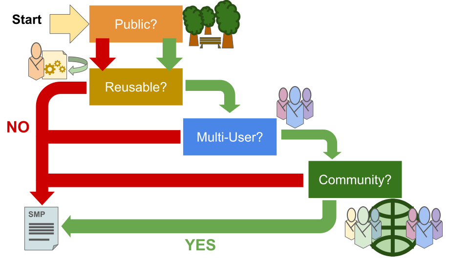

:::::::::::::::::::::::::::::::::::::: questions 

- Why did we introduce a decision tree at the beginning of our questionnaire?

::::::::::::::::::::::::::::::::::::::::::::::::

After introducing the name of your project and its purpose, you will enter the part of the tool that allows you to identify the relevant questions in the Software Management Plan for your project. We have constructed a decision tree that will guide you towards the minimum requirements for your SMP.

Figure

The reasoning behind the structure of the decision tree is to allow you to jump out of the process and into filling out the SMP as soon as possible. As you might notice from the figure above, the more people are involved in a project, the more complex the SMP is going to be.
With the same reasoning in mind, the least amount of people need to interact with your software, the least amount of bureaucracy you need to perform on it. This results in a shorter and more compact SMP.

The first question you'll encounter in the decision tree is whether your software is going to be public or not. Regardless of your answer, you will continue to the next question, but should your software be (or become) public, there will be questions regarding licensing and citation, as well as basic user documentation, added to the SMP.
The next question is the first that lets you jump out of the Decision Tree and into filling in the SMP, should you choose no. If your software is designed and intended for one time use, then the SMP you need for it is going to be rather simple. Let's consider a software that is in fact not going to be public (no to the first question) and not going to be reused after its initial purpose (no to the second question).

Introduce Case A

Moving on from this simple case, we add complexity as the number of people involved or impacted by your software grows. If your software is going to be reused, then at least one person will have to work with it again: you yourself. Even if you are the only one who will work with this software in the future, it is still a good idea to have documentation help you pin down decisions you made and functions of the software. If other people will be using the software, documentation is even more relevant.

The next question in the decision tree asks you if multiple users will be working with your software. This can vary between a small group of people you are in contact with or a larger group which you might not be able to provide support on yourself. 

Introduce the three main questions of the decision tree.
Multi-User
Reuse
Community
Knowledge of the consequences of opening up the software to a wider use.
What is the difference between multi-user and community?
Knowledge of the consequences of reusing the software
What is essential for others to reuse software not developed by them?
When is documentation enough?
Remarkable cases:
N/N/N - One time use, simplest plan needed
N/N/Y - One time use, but may need to be made public for verification purposes? Journal request?
Y/Y/N - Closed community?
Based on the information that you gathered from the decision tree, you can now understand the scope of a project and its potential impact.
Decision tree is stored in the JSON file, not the DOCX or the Cookiecutter file.
Should the “trainer” ask the researcher for decision tree information as well when checking SMP, if SMP is generated with our tool?
